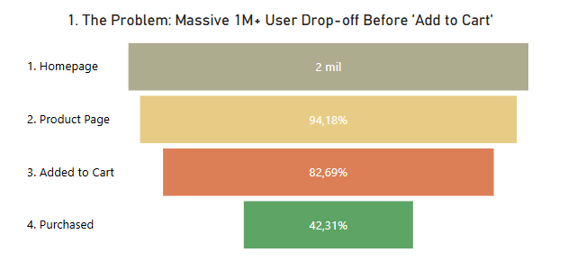
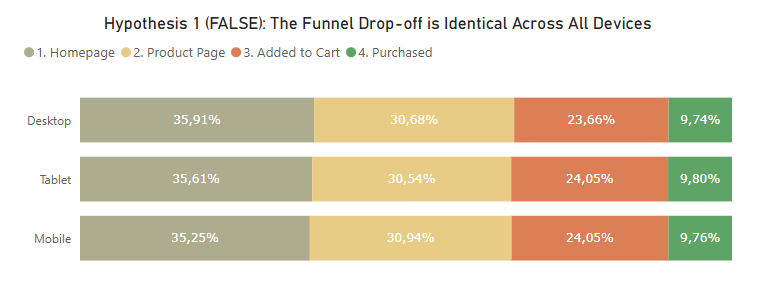
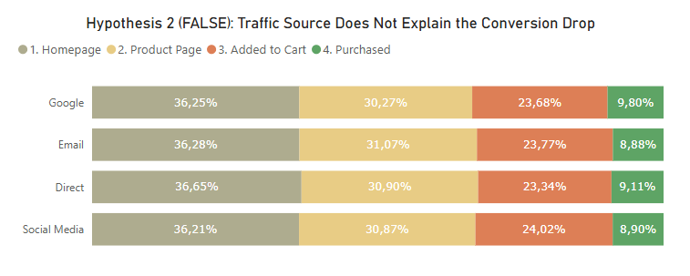
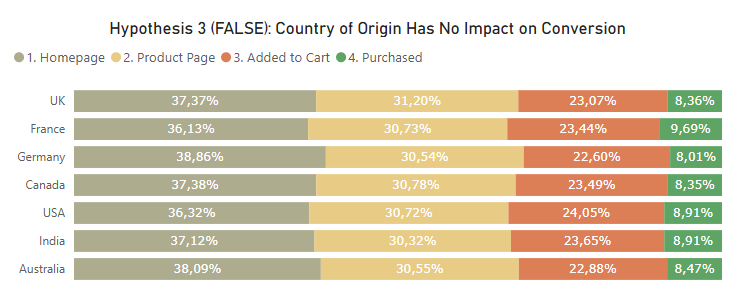
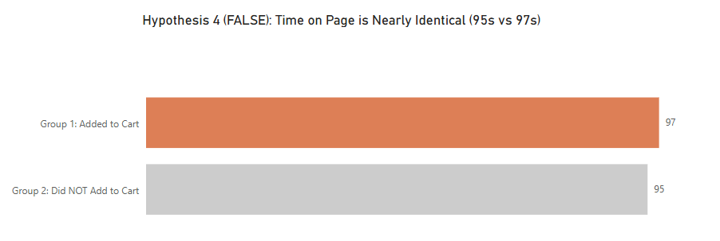

---

[Read in English](#english) | [Leer en Español](#espanol)

---

&lt;a name="english"&gt;&lt;/a&gt;

# 📊 E-Commerce Funnel & Segmentation Analysis (SQL + Power BI)

This is a **Funnel Analysis** project that replicates a real-world business scenario.
The analysis follows a detective's journey: from finding a problem (The "What")
to systematically testing and disproving 4 common hypotheses to find
the true root cause (The "Why").

This project demonstrates key Data Analyst skills:
* **Technical Analysis (SQL):** Using `CTEs`, `CASE WHEN`, `JOINs`, and `GROUP BY` to clean, segment, and analyze data at the session level.
* **Data Visualization (Power BI):** Building a dashboard that tells a clear story, using intentional color palettes and conclusive titles.
* **Business Acumen:** Formulating hypotheses, validating them with data, and delivering an actionable business recommendation.

**Tools Used:** MySQL, Power BI, SQL

---

## 1. The Business Problem
The objective was to analyze the user flow to identify the largest drop-off
in the conversion funnel. My job was not just to find *where* users were dropping,
but *why*, by following a process of hypothesis and validation.

---

## 2. About the Data
This project uses a synthetic, publicly available e-commerce dataset (`customer_journey.csv`) that tracks complete user sessions, from the first click to the final conversion. The data was imported into a MySQL database (`funnel_project`) and analyzed from a single table (`event_log`).

### Data Dictionary (Schema)
The `event_log` table has the following structure:

| Column | Description | Data Type |
| :--- | :--- | :--- |
| `SessionID` | The unique identifier for a user session. | `VARCHAR` |
| `UserID` | The unique identifier for a user. | `VARCHAR` |
| `Timestamp` | The date and time of the event. | `TIMESTAMP` |
| `PageType` | The stage of the funnel (`home`, `product_page`, `cart`, `checkout`, `confirmation`). | `VARCHAR` |
| `DeviceType` | The device used (e.g., 'Mobile', 'Desktop', 'Tablet'). | `VARCHAR` |
| `Country` | The user's country of origin. | `VARCHAR` |
| `ReferralSource`| The source of the traffic (e.g., 'Google', 'Social Media'). | `VARCHAR` |
| `TimeOnPage_seconds` | Time spent on the page in seconds. | `INT` |
| `ItemsInCart` | Number of items in the user's cart. | `INT` |
| `Purchased` | (Boolean) 1 if the session ended in a purchase, 0 otherwise. | `INT` |

---

## 3. The Engine (SQL Queries)
Instead of loading raw data into Power BI (which is slow and inefficient), I used MySQL
to perform all the analysis. Power BI connects only to the clean, aggregated results,
which is a best practice. The analysis is performed at the **SessionID** level to accurately track individual user journeys.

All SQL queries are stored as separate files for better version control and reusability:

&lt;details&gt;
&lt;summary&gt;Click to see all 5 SQL Queries&lt;/summary&gt;

**Query 1: General 5-Step Funnel (The "What")**
Counts unique SessionIDs that reached each page.
- **File:** [`sql_queries/01_general_funnel.sql`](sql_queries/01_general_funnel.sql)

**Query 2: Hypothesis 1 (Device)**
Segmentation Query 1 (The "Why" - Part 1: Device)
- **File:** [`sql_queries/02_device_segmentation.sql`](sql_queries/02_device_segmentation.sql)

**Query 3: Hypothesis 2 (Referral Source)**
Segmentation Query 2 (The "Why" - Part 2: Referral)
- **File:** [`sql_queries/03_referral_segmentation.sql`](sql_queries/03_referral_segmentation.sql)

**Query 4: Hypothesis 3 (Country)**
Segmentation Query 3 (The "Why" - Part 3: Country)
- **File:** [`sql_queries/04_country_segmentation.sql`](sql_queries/04_country_segmentation.sql)

**Query 5: Hypothesis 4 (Time on Page)**
Segmentation Query 4 (The "Why" - Part 4: TimeOnPage)
- **File:** [`sql_queries/05_time_onpage_analysis.sql`](sql_queries/05_time_onpage_analysis.sql)

&lt;/details&gt;

---

## 4. The Investigation (Step-by-Step Analysis)

My analysis followed a process of hypothesis elimination.

**Insight 1 (The "What"): Identifying the Problem**
The first step was to understand the 5-step funnel. The data shows two major drop-offs: one at Product Page -&gt; Cart (the largest) and another at Cart -&gt; Checkout. The investigation focused on the first drop.

**Insight 2 (Hypothesis 1: FALSE): Is it a Device Issue?**
My first hypothesis was that it could be a technical issue (e.g., the "Add to Cart" button is broken on mobile). 

**Conclusion: FALSE.** The device segmentation chart shows that the drop-off percentage is identical across Mobile, Desktop, and Tablet. The problem is not technical.

**Insight 3 (Hypothesis 2: FALSE): Is it a Marketing Issue?**
My second hypothesis was that the marketing team was driving "junk traffic" (e.g., from Social Media) that would browse but never buy.

**Conclusion: FALSE.** The referral source segmentation chart shows that all sources (Social Media, Email, Direct, Google) have the exact same drop-off pattern. The traffic is good quality; the problem is on the page.

**Insight 4 (Hypothesis 3: FALSE): Is it a Logistics Issue?**
My third hypothesis was that it could be a logistics problem (e.g., high shipping costs to certain countries).

**Conclusion: FALSE.** The country segmentation chart shows the drop-off is universal. Users in the USA, UK, India, and France abandon at the same rate. It is not a shipping issue.

**Insight 5 (Hypothesis 4: FALSE): Is it a Clarity Issue?**
My final hypothesis was that the product page was confusing, and users were leaving quickly because they didn't understand the offer.

**Conclusion: FALSE.** The time-on-page analysis shows that users who do NOT add to cart (Group 2) spend 95 seconds on average, almost the same as the 97 seconds spent by those who DO (Group 1). Users have plenty of time to decide; the problem is not confusion.

## 5. Final Conclusion & Recommendation

I have scientifically proven that the problem is **NOT** technical (mobile), **NOT** marketing (traffic), **NOT** logistics (countries), and **NOT** clarity (time on page).

**The problem is UNIVERSAL and FUNDAMENTAL.**

The drop-off is a "tax" that the Product Page's User Experience (UX) is charging all users equally.

### Business Recommendation
The Product (UX/UI) team must stop looking for external culprits and focus 100% on redesigning the product page. I recommend running A/B Tests on the only elements that all users see:

- **The Price** (Test a discount).
- **The 'Add to Cart' Button** (Test a different color/text).
- **The Offer** (Test adding a 'Free Shipping' banner).

---

&lt;br&gt;&lt;br&gt;&lt;br&gt;

---

&lt;a name="espanol"&gt;&lt;/a&gt;

# 📊 Análisis de Embudo y Segmentación en E-Commerce (SQL + Power BI)

Este es un proyecto de **Análisis de Embudo** que replica un escenario empresarial real.
El análisis sigue el viaje de un detective: desde encontrar un problema (El "Qué")
hasta probar y refutar sistemáticamente 4 hipótesis comunes para encontrar
la verdadera causa raíz (El "Por qué").

Este proyecto demuestra habilidades clave de Analista de Datos:
* **Análisis Técnico (SQL):** Uso de `CTEs`, `CASE WHEN`, `JOINs` y `GROUP BY` para limpiar, segmentar y analizar datos a nivel de sesión.
* **Visualización de Datos (Power BI):** Creación de un dashboard que cuenta una historia clara, usando paletas de colores intencionales y títulos conclusivos.
* **Visión de Negocio:** Formulación de hipótesis, validación con datos y entrega de recomendaciones empresariales accionables.

**Herramientas Usadas:** MySQL, Power BI, SQL

---

## 1. El Problema de Negocio
El objetivo era analizar el flujo de usuarios para identificar la mayor caída
en el embudo de conversión. Mi trabajo no era solo encontrar *dónde* abandonaban los usuarios,
sino *por qué*, siguiendo un proceso de hipótesis y validación.

---

## 2. Sobre los Datos
Este proyecto usa un dataset sintético y público de e-commerce (`customer_journey.csv`) que rastrea sesiones completas de usuarios, desde el primer clic hasta la conversión final. Los datos se importaron a una base de datos MySQL (`funnel_project`) y se analizaron desde una única tabla (`event_log`).

### Diccionario de Datos (Esquema)
La tabla `event_log` tiene la siguiente estructura:

| Columna | Descripción | Tipo de Dato |
| :--- | :--- | :--- |
| `SessionID` | Identificador único de la sesión de usuario. | `VARCHAR` |
| `UserID` | Identificador único del usuario. | `VARCHAR` |
| `Timestamp` | Fecha y hora del evento. | `TIMESTAMP` |
| `PageType` | Etapa del embudo (`home`, `product_page`, `cart`, `checkout`, `confirmation`). | `VARCHAR` |
| `DeviceType` | Dispositivo usado (ej. 'Mobile', 'Desktop', 'Tablet'). | `VARCHAR` |
| `Country` | País de origen del usuario. | `VARCHAR` |
| `ReferralSource`| Fuente del tráfico (ej. 'Google', 'Social Media'). | `VARCHAR` |
| `TimeOnPage_seconds` | Tiempo en la página en segundos. | `INT` |
| `ItemsInCart` | Número de artículos en el carrito. | `INT` |
| `Purchased` | (Booleano) 1 si la sesión terminó en compra, 0 si no. | `INT` |

---

## 3. El Motor (Consultas SQL)
En lugar de cargar datos crudos en Power BI (lo cual es lento e ineficiente), usé MySQL
para realizar todo el análisis. Power BI solo se conecta a los resultados limpios y agregados,
lo cual es una mejor práctica. El análisis se realiza a nivel de **SessionID** para rastrear con precisión los viajes individuales de los usuarios.

Todas las consultas SQL están almacenadas como archivos separados para mejor control de versiones y reusabilidad:

&lt;details&gt;
&lt;summary&gt;Haz clic para ver las 5 consultas SQL&lt;/summary&gt;

**Consulta 1: Embudo General de 5 Pasos (El "Qué")**
Cuenta SessionIDs únicos que llegaron a cada página.
- **Archivo:** [`sql_queries/01_general_funnel.sql`](sql_queries/01_general_funnel.sql)

**Consulta 2: Hipótesis 1 (Dispositivo)**
Consulta de Segmentación 1 (El "Por qué" - Parte 1: Dispositivo)
- **Archivo:** [`sql_queries/02_device_segmentation.sql`](sql_queries/02_device_segmentation.sql)

**Consulta 3: Hipótesis 2 (Fuente de Referral)**
Consulta de Segmentación 2 (El "Por qué" - Parte 2: Referral)
- **Archivo:** [`sql_queries/03_referral_segmentation.sql`](sql_queries/03_referral_segmentation.sql)

**Consulta 4: Hipótesis 3 (País)**
Consulta de Segmentación 3 (El "Por qué" - Parte 3: País)
- **Archivo:** [`sql_queries/04_country_segmentation.sql`](sql_queries/04_country_segmentation.sql)

**Consulta 5: Hipótesis 4 (Tiempo en Página)**
Consulta de Segmentación 4 (El "Por qué" - Parte 4: TimeOnPage)
- **Archivo:** [`sql_queries/05_time_onpage_analysis.sql`](sql_queries/05_time_onpage_analysis.sql)

&lt;/details&gt;

---

## 4. La Investigación (Análisis Paso a Paso)

Mi análisis siguió un proceso de eliminación de hipótesis.

**Insight 1 (El "Qué"): Identificando el Problema**
El primer paso fue entender el embudo de 5 pasos. Los datos muestran dos caídas importantes: una en Product Page -&gt; Cart (la más grande) y otra en Cart -&gt; Checkout. La investigación se centró en la primera caída.

**Insight 2 (Hipótesis 1: FALSA): ¿Es un problema de Dispositivo?**
Mi primera hipótesis fue que podría ser un problema técnico (ej. el botón "Añadir al Carrito" está roto en móvil). 

**Conclusión: FALSA.** El gráfico de segmentación por dispositivo muestra que el porcentaje de abandono es idéntico en Mobile, Desktop y Tablet. El problema no es técnico.

**Insight 3 (Hipótesis 2: FALSA): ¿Es un problema de Marketing?**
Mi segunda hipótesis fue que el equipo de marketing estaba generando "tráfico de baja calidad" (ej. desde Social Media) que navegaría pero nunca compraría.

**Conclusión: FALSA.** El gráfico de segmentación por fuente de referal muestra que todas las fuentes (Social Media, Email, Direct, Google) tienen exactamente el mismo patrón de abandono. El tráfico es de buena calidad; el problema está en la página.

**Insight 4 (Hipótesis 3: FALSA): ¿Es un problema Logístico?**
Mi tercera hipótesis fue que podría ser un problema logístico (ej. altos costos de envío a ciertos países).

**Conclusión: FALSA.** El gráfico de segmentación por país muestra que el abandono es universal. Usuarios en USA, UK, India y Francia abandonan a la misma tasa. No es un problema de envío.

**Insight 5 (Hipótesis 4: FALSA): ¿Es un problema de Claridad?**
Mi hipótesis final fue que la página de producto era confusa, y los usuarios se iban rápido porque no entendían la oferta.

**Conclusión: FALSA.** El análisis de tiempo-en-página muestra que usuarios que NO añaden al carrito (Grupo 2) pasan 95 segundos en promedio, casi lo mismo que los 97 segundos de los que SÍ lo añaden (Grupo 1). Los usuarios tienen tiempo suficiente para decidir; el problema no es confusión.

## 5. Conclusión Final y Recomendación

He probado científicamente que el problema **NO** es técnico (móvil), **NO** es marketing (tráfico), **NO** es logística (países), y **NO** es claridad (tiempo en página).

**El problema es UNIVERSAL y FUNDAMENTAL.**

La caída es un "impuesto" que la Experiencia de Usuario (UX) de la Página de Producto está cobrando a todos los usuarios por igual.

### Recomendación de Negocio
El equipo de Producto (UX/UI) debe dejar de buscar culpables externos y enfocarse 100% en rediseñar la página de producto. Recomiendo ejecutar Pruebas A/B en los únicos elementos que todos los usuarios ven:

- **El Precio** (Probar un descuento).
- **El Botón 'Añadir al Carrito'** (Probar un color/texto diferente).
- **La Oferta** (Probar añadir un banner de 'Envío Gratis').

---
